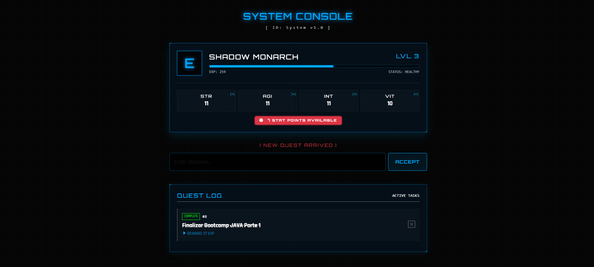

# 🗡️ System RPG Tracker (Hunter Edition)

> "O Sistema convida-te a tornares-te um Jogador."

Este é um Gestor de Tarefas Gamificado inspirado na interface do anime/manhwa **Solo Leveling**. O objetivo é transformar a produtividade diária num jogo de RPG, onde concluir tarefas garante XP, subida de nível e pontos de atributos reais.

## 🖥️ Pré-visualização da Interface


## 🎮 Funcionalidades (The System Features)
- **Quest Log:** Adiciona e gere as tuas tarefas diárias.
- **Level Up System:** Ganha XP aleatório (Rank E a S) por tarefa concluída.
- **Stat Distribution:** Ao subir de nível, ganha pontos para distribuir em Força, Agilidade, Inteligência e Vitalidade.
- **Rank Dinâmico:** O teu Rank de Caçador (E, D, C, B, A, S) evolui conforme o teu nível aumenta.
- **Persistent Data:** Todo o progresso é guardado numa base de dados PostgreSQL.

## 🛠️ Tecnologias Utilizadas
- **Backend:** Java 17, Spring Boot 3
- **Frontend:** Thymeleaf, HTML5, CSS3 (Glassmorphism & Neon UI)
- **Base de Dados:** PostgreSQL
- **Ferramentas:** Maven, Git

## 🚀 Como Rodar o Projeto

### Pré-requisitos
- Java 17+ instalado
- PostgreSQL instalado e a correr
- Maven

### Passos
1. Clona o repositório:
   ```bash
   git clone [https://github.com/matheusbgoes/rpg-tracker-mvp.git](https://github.com/matheusbgoes/rpg-tracker-mvp.git)